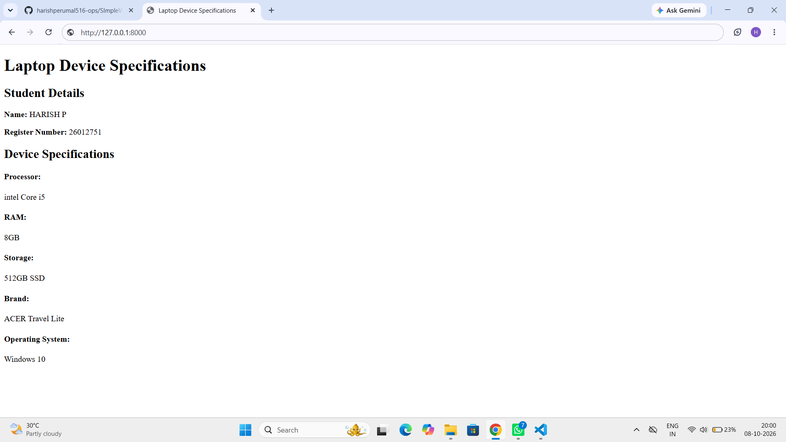

# SImpleWEBSever
# EX01 Developing a Simple Webserver
## Date:

## AIM:
To develop a simple webserver to serve html pages and display the Device Specifications of your Laptop.

## DESIGN STEPS:
### Step 1: 
HTML content creation.

### Step 2:
Design of webserver workflow.

### Step 3:
Implementation using Python code.

### Step 4:
Import the necessary modules.

### Step 5:
Define a custom request handler.

### Step 6:
Start an HTTP server on a specific port.

### Step 7:
Run the Python script to serve web pages.

### Step 8:
Serve the HTML pages.

### Step 9:
Start the server script and check for errors.

### Step 10:
Open a browser and navigate to http://127.0.0.1:8000 (or the assigned port).

## PROGRAM:
```
<!DOCTYPE html>
<html>
<head>
    <title>Laptop Device Specifications</title>
</head>
<body>

    <h1>Laptop Device Specifications</h1>

    <h2>Student Details</h2>
    <p><b>Name:</b> HARISH P</p>
    <p><b>Register Number:</b> 26012751</p>

    <h2>Device Specifications</h2>

    <p><h4><b>Processor:</b></h4> intel Core i5  <br>
        <h4><b>RAM:</b></h4> 8GB <br>
        <h4><b>Storage:</b></h4> 512GB SSD<br>
        <h4><b>Brand:</b></h4> ACER Travel Lite<br>
        <h4><b>Operating System:</b></h4> Windows 10 <br>
        </p>

</body>
</html>
```

## OUTPUT:


## RESULT:
The program for implementing simple webserver is executed successfully.
